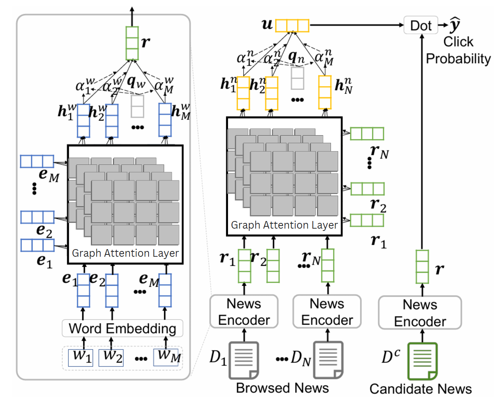
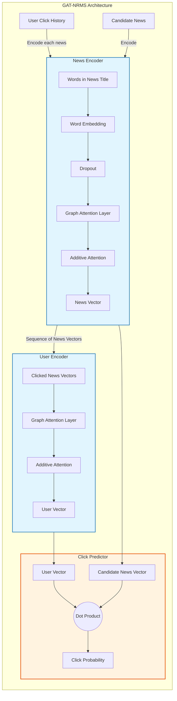
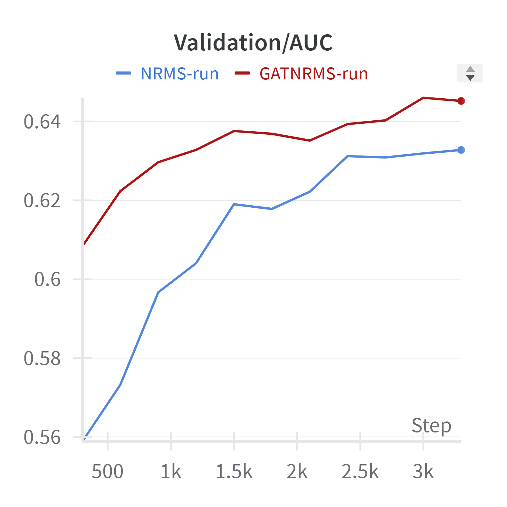
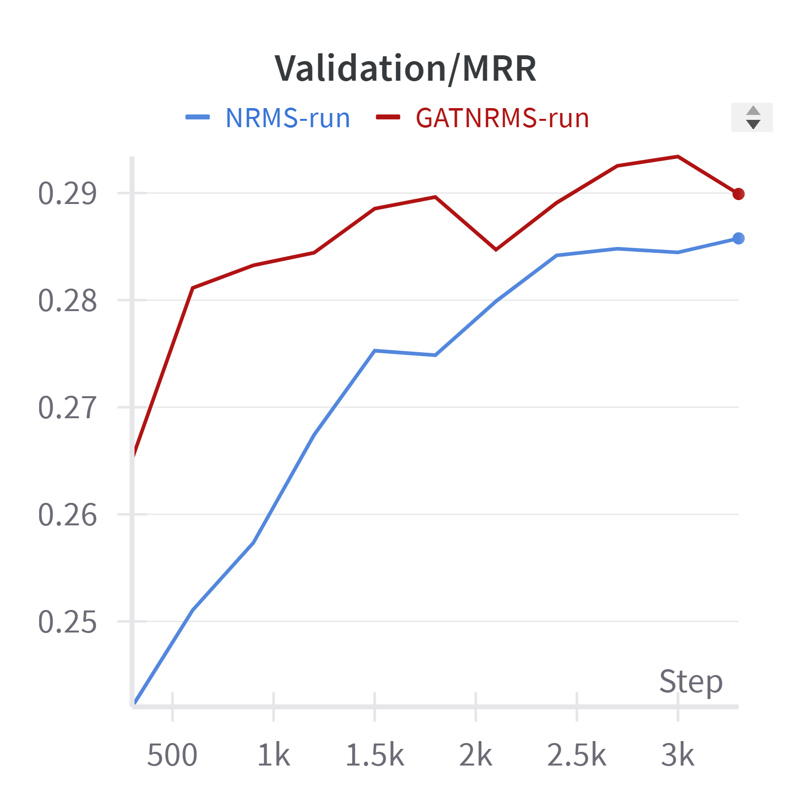
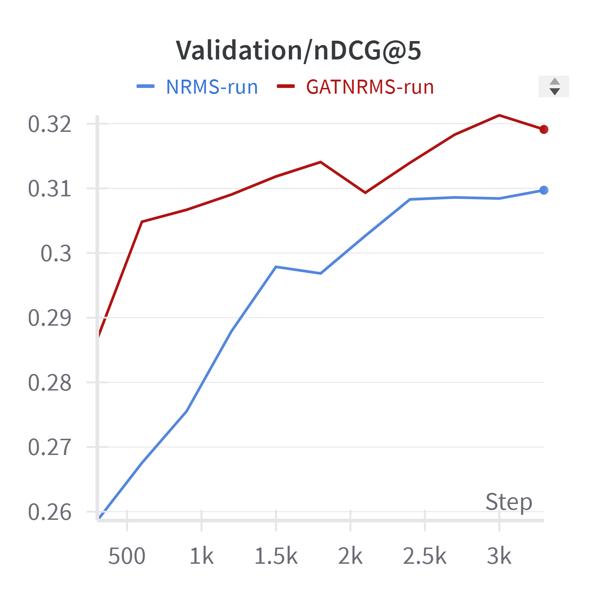
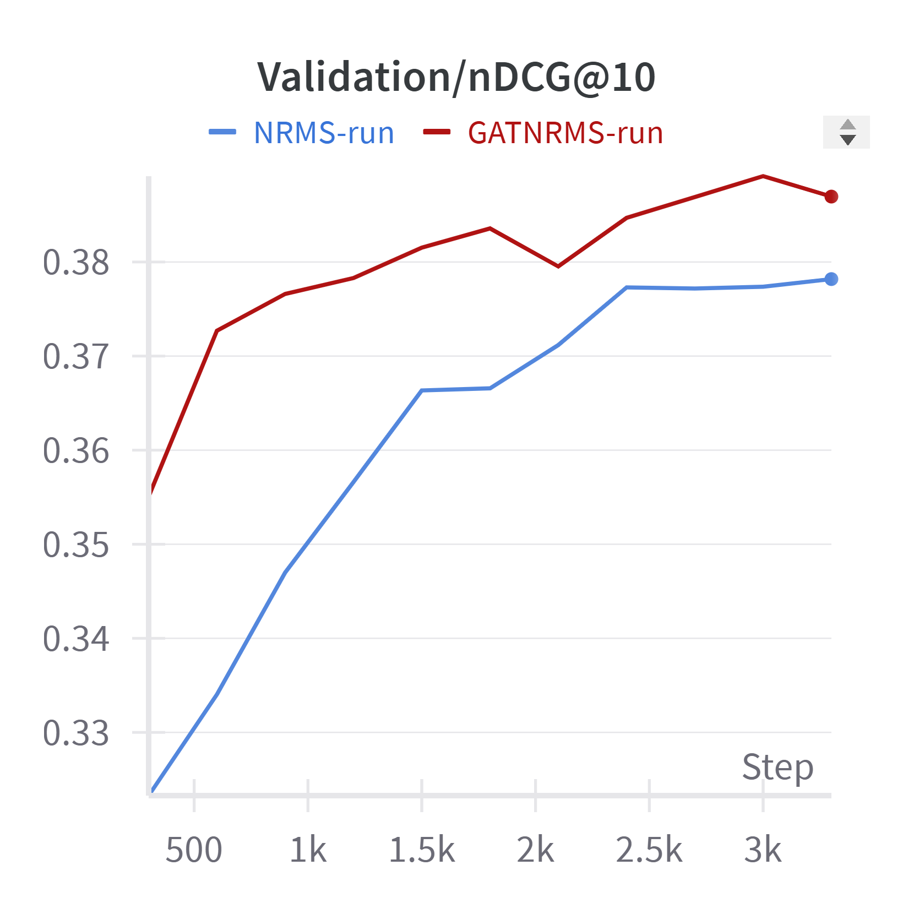
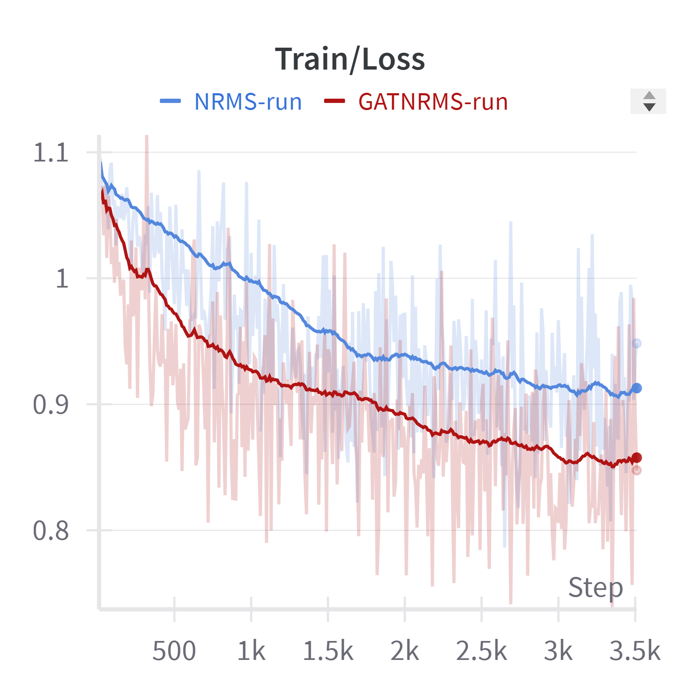
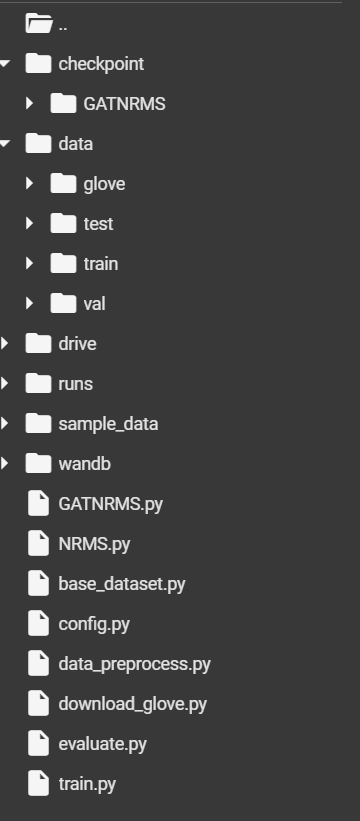

# GAT-NRMS: Graph Attention Network for Neural News Recommendation



**GAT-NRMS** (Graph Attention Network - Neural News Recommendation System) is an advanced deep learning model for personalized news recommendation. This project is built on top of the MIND (MIcrosoft News Dataset) Small dataset and leverages Graph Attention Networks (GAT) alongside Additive Attention mechanisms to learn highly accurate representations of both news articles and user preferences.

---

## 📊 Project Overview

Traditional news recommendation systems often struggle to capture the complex, non-linear relationships between words in a news title and the historical interactions of a user. GAT-NRMS addresses this by introducing **Graph Attention Layers** into both the News Encoder and the User Encoder.

### Key Features:
- **News Encoder**: Uses GloVe word embeddings (840B.300d), a Graph Attention Layer to capture word-level relationships, and Additive Attention to select the most informative words.
- **User Encoder**: Processes a user's clicked news history using a Graph Attention Layer to model the transition/relationship between clicked articles, followed by Additive Attention to form a unified user representation.
- **Click Predictor**: Computes the dot product between the candidate news vector and the user vector to predict the probability of a click.

---

## 🧠 Architecture Flow

Below is the human-made architecture flow illustrating how data propagates through the GAT-NRMS model:



---

## 📈 Performance & Results

The model was evaluated on the MIND Small dataset using standard ranking metrics. The best validation metrics achieved during training are:

- **AUC**: `0.6460`
- **MRR**: `0.2934`
- **nDCG@5**: `0.3213`
- **nDCG@10**: `0.3891`

### Training Visualizations

| AUC | MRR |
|:---:|:---:|
|  |  |

| nDCG@5 | nDCG@10 |
|:---:|:---:|
|  |  |

**Loss Curve:**


---

## 📂 Repository Structure



```text
.
├── README.md
├── requirements.txt
├── images/                             # Contains architecture and evaluation plots
│   ├── GAT-NRMS.png
│   ├── auc.png, mrr.png, loss_curve.png, etc.
└── src/
    ├── config.py                       # Hyperparameters and model configurations
    ├── GATNRMS.py                      # Core PyTorch implementation of GAT-NRMS
    ├── NRMS.py                         # Baseline NRMS implementation
    ├── data_preprocess.py              # Script to parse MIND dataset and embeddings
    ├── data_preprocess_notebook.ipynb  # Interactive data preprocessing
    ├── download_glove.py               # Script to fetch GloVe embeddings
    ├── evaluate.py                     # Evaluation metrics (AUC, MRR, nDCG)
    └── train.ipynb                     # Main training and validation notebook
```

---

## ⚙️ Installation & Setup

### 1. Prerequisites
Ensure you have Python 3.7+ installed. Install the required dependencies:

```bash
pip install -r requirements.txt
pip install torch pandas numpy scikit-learn tqdm
```

### 2. Dataset Preparation
1. Download the **MIND Small Dataset** from [https://msnews.github.io/](https://msnews.github.io/).
2. *Note:* The MIND Small dataset only provides `train` and `val` sets. Copy the `val` dataset to a `test` directory for evaluation purposes.
3. Extract and organize the dataset in the following structure at the root of the project:
   ```text
   /data/train/
   /data/test/
   /data/val/
   ```
4. Download the GloVe embeddings (840B.300d) and place them in `/data/glove/`. (You can use `src/download_glove.py` if applicable).

---

## 🚀 Usage

1. **Preprocess the Data**: 
   The data preprocessing is handled automatically in the training notebook, or you can run it manually:
   ```bash
   python src/data_preprocess.py
   ```
2. **Train the Model**:
   Open and execute `src/train.ipynb` to start training the GAT-NRMS model. The notebook handles data loading, model initialization, training loops, and validation metric logging.

---

## 📦 Pre-trained Weights

Pre-trained model weights for **GAT-NRMS** are publicly available on Hugging Face:
🔗 [GAT-NRMS-NewsRecommender Weights](https://huggingface.co/Jiraheya/GAT-NRMS-NewsRecommender/tree/main)

---

*Developed for CMPE 256.*